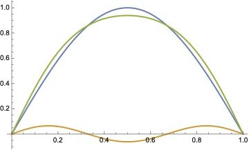

# Midterm solutions

**Question 1.** A particle in an infinite square well between $x=0$ and $x=a$ is subject to a perturbing potential $V(x) = \epsilon E_1^{(0)}\sin(\pi x/a)$, where $\epsilon$ is small and $E_1^{(0)}$ is the unperturbed ground state energy. Use perturbation theory to (a) compute the first order energy shift for all states and (b) compute the first order correction to the ground state wavefunction. Plot the new ground state wavefunction on top of the unperturbed ground state wavefunction and compare them (choose the value of $\epsilon$ so that the differences are large enough to see on your plot). Explain whether the difference makes sense physically.

````{dropdown} Solution

This question is similar to the question in homework 7, but is more straighforward because the well extends from $x=0$ to $x=a$ so we can write all the wavefunctions in terms of $\sin$ functions. The unperturbed wavefunctions are 

$$\psi^{(0)}(x) = \sqrt{2\over a} \sin\left(\frac{n\pi x}{a}\right)$$

with energies $E_n^{(0)} = n^2 \hbar^2 / 2ma^2$. The normalization is such that $\int_0^a dx |\psi^{(0)}(x)|^2 = 1$.

The first order energy shift for each state is given by $\braket{\Psi^{(0)}_n|\hat{H}_1|\Psi^{(0)}_n}$, or

$$E^{(1)}_n = \epsilon E_1^{(0)}\ {2\over a}\int_0^a dx\, \sin^2\left({n \pi x\over a}\right)\sin\left({\pi x\over a}\right)$$

or with $\theta = \pi x/a$

$$E^{(1)}_n = \epsilon E_1^{(0)}\ {2\over \pi} \int_0^\pi d\theta\, \sin^2\left({n \theta}\right)\sin\left({\theta}\right) = {\epsilon E_1^{(0)}\over \pi} {16n^2\over 8n^2-2}.$$


The first order correction to the ground state wavefunction is

$$\psi^{(1)}_1 = \sum_{k>1} c_k \sqrt{2\over a}\sin\left({k \pi x\over a}\right)$$

with 

$$c_k = \epsilon E_1^{(0)}{2\over a}{1\over E_1^{(0)}-E_k^{(0)}} \int_0^a dx\, \sin^2\left({\pi x\over a}\right)\sin\left({k \pi x\over a}\right)$$

$$\Rightarrow c_k = {2\epsilon\over \pi} {1\over 1-k^2} {-2 + 2(-1)^k\over -4k + k^3}$$

or

$$c_k = {2\epsilon\over \pi} {1\over k(1-k^2)(1-k^2/4)}\hspace{1cm} k\ \mathrm{odd}.$$

To plot this in Mathematica (assuming $a=1$ and dropping the overall normalization factor for simplicity)

```
psi0[x_] := Sin[Pi  x]

psi1[x_, epsilon_] := 
 Sum[Sin[k  Pi  x] (2  epsilon/Pi)/(k (1 - k^2) (1 - k^2/4)), {k, 3, 
   7, 2}]
   
Plot[{psi0[x], psi1[x, 3], psi0[x] + psi1[x, 3]}, {x, 0, 1}, 
 PlotLegends -> {"Unperturbed", "Perturbation", "Perturbed"}]
```



We've set $\epsilon=3$ to be able to clearly see the effect of the perturbation, and I stop the sum at $k=7$ (the contribution from the higher order terms drops off rapidly with increasing $k$). The perturbed wavefunction is flatter in the center and pushed out towards the edges of the box. Physically, this makes sense because the perturbing potential corresponds to a force that pushes the particle away from $x=0$, increasing the probability of finding the particle closer to the edges of the box. You can also think of this in terms of the wavelength: at the center of the box, the potential has increased and so the kinetic energy is smaller, corresponding to a longer wavelength, and so the wavefunction is less curved at the center.
 
````

**Question 2.** (a) By writing the lowering operator for the 3D harmonic oscillator

$$\hat{a}_\ell = {1\over \sqrt{2m\hbar\omega}} \left(i\hat{p_r} - {(\ell+1)\hbar\over \hat{r}} + m\omega\hat{r}\right)$$

in position representation, derive an expression for the wavefunction $\psi(r,\theta,\phi)$ that satisfies

$$\hat{a}_\ell \psi(r,\theta,\phi) = 0.$$

You should make sure that your wavefunction is correctly normalized.

(b) Does this state correspond to the lowest energy state at a given $\ell$? Explain why or why not.

````{dropdown} Solution

Writing $\psi(r,\theta,\phi)=Y_{\ell,m}(\theta,\phi)R(r)$ and the operator $\hat{a}_\ell$ in position representation with the help of the formula sheet, we have to solve

$${1\over \sqrt{2m\hbar\omega}}\left(\hbar{\partial\over\partial r} + {\hbar\over r}-{(\ell+1)\hbar\over r}+m\omega r\right)R(r)=0$$

$$\Rightarrow\left({\partial\over\partial r} -{\ell\over r}+{m\omega\over\hbar} r\right)R(r)=0.$$

By inspection of each term, we can see that the solution to this is

$$R(r) \propto r^\ell \exp\left(-{m\omega r^2\over 2\hbar}\right).$$

The full wavefunction is $\psi(r,\theta,\phi) = A Y_{\ell m} r^\ell e^{-m\omega r^2/2\hbar}$. Since the $Y_{\ell,m}$ part is already normalized ($\int d\Omega |Y_{\ell,m}|^2=1$) then we just need

$$A^2 \int dr\ r^{2\ell+2} e^{-ar^2} = 1$$

with $a=m\omega/\hbar$. Using the integral from the formula sheet, we get

$$A = \left({m\omega\over \hbar}\right)^{(2\ell+3)/4} \left[{1\over 2}\Gamma\left({2\ell+3\over 2}\right)\right]^{-1/2}.$$

This state does indeed correspond to the lowest energy for a given value of $\ell$. This is not necessarily obvious because remember that the energy levels of the 3D harmonic oscillator are given by $(2n_r + \ell + 3/2)\hbar\omega$ and the effect of $a_\ell$ is to move to the state with one less radial node but with $\ell$ increased by one. However, if you look at the energy level diagram in Figure 10.14 of Townsend, the effect of $\hat{a}_\ell$ is to move down and to the right in this diagram. We can then see that if there is no state to move to then we must be at the lowest energy for that value of $\ell$. Another way to see this is to note that there are no radial nodes in the wavefunction we've derived here, so with $\ell$ fixed it is not possible to remove a radial node and move to a lower energy state.
````

**Question 3.** Calculate the first order energy splittings and eigenstates for the $n=3$ Stark effect in hydrogen. For the energies, you can give your answer in units of $ea_0E$.

````{dropdown} Solution

For $n=3$ there are $n^2=9$ possible states:

$$\ket{3 0 0},$$

$$\ket{3 1 -1}, \ket{3 1 0}, \ket{3 1 1},$$

$$\ket{3,2,-2}, \ket{3 2 -1}, \ket{3 2 0}, \ket{3 2 1}, \ket{3 2 2}.$$

This means that in principle we have a 9x9 matrix to diagonalize. However, just as with $n=2$, we can use the dipole selection rule to show that most of these vanish. We need $\Delta m =0$ and $\Delta \ell =\pm 1$, so the only non-zero matrix elements are

$$\braket{3,1,0|\hat{z}|3,0,0} = -9\sqrt{2} a_0 \times {1\over\sqrt{3}} = -3\sqrt{6} a_0$$

$$\braket{3,2,0|\hat{z}|3,1,0} = -{9\sqrt{5}\over 2} a_0 \times {2\over \sqrt{15}}=-3\sqrt{3} a_0$$

$$\braket{3,2,-1|\hat{z}|3,1,-1} = -{9\sqrt{5}\over 2} a_0 \times {1\over \sqrt{5}} = -{9\over 2}a_0$$

$$\braket{3,2,1|\hat{z}|3,1,1} = -{9\sqrt{5}\over 2} a_0 \times {1\over \sqrt{5}} = -{9\over 2}a_0$$

(and their complex conjugates). Here I've used the values for the corresponding angular and radial integrals from the formula sheet, also using the fact that $z = r \cos\theta$ which gives an extra factor of $r$ in the radial integral and the factor of $\cos\theta$ in the angular integral.

One way to proceed is to write out the $9\times 9$ matrix and diagonalize it. However, we can also simplify the problem by first noting that all matrix elements involving $\ket{3,2,-2}$ or $\ket{3,2,2}$ vanish. These two states are unaffected by the perturbation, with zero energy shift. The three states $\ket{3,0,0}$, $\ket{3,1,0}$ and $\ket{3,2,0}$ are coupled together by the first two matrix elements in the list above. If we write down $\hat{z}$ in this subspace, it looks like

$$\begin{pmatrix}
0 & -3\sqrt{6} & 0 \\
-3\sqrt{6} & 0 & -3\sqrt{3} \\
0 & -3\sqrt{3} & 0 
\end{pmatrix}
$$

This matrix has 3 eigenvalues: $0$ with eigenvector $(-\sqrt{1/3}, 0, \sqrt{2/3})$, and $\pm 9$ with eigenvectors $(1/\sqrt{3}, \mp 1/\sqrt{2}, 1/\sqrt{6})$.
To find the eigenvalues and eigenvectors in Mathematica you can use

```
Eigensystem[{{0, -3  Sqrt[6], 0}, {-3  Sqrt[6], 
   0, -3 Sqrt[3]}, {0, -3 Sqrt[3], 0}}]
```

Finally, the two pairs of states ($\ket{3,1,1}$ and $\ket{3,2,1}$) and ($\ket{3,1,-1}$ and $\ket{3,2,-1}$) are each coupled with matrix

$$\begin{pmatrix}
0 & 9/2 \\
9/2 & 0
\end{pmatrix}
$$

with eigenvalues $\pm 9/2$ and eigenstates $(1, -1)/\sqrt{2}$ and $(1,1)/\sqrt{2}$.

To summarize, the states and energy shifts are:

$$\ket{3,2,-2},\ket{3,2,2},-\sqrt{1\over 3}\ket{3,0,0}+\sqrt{2\over 3}\ket{3,2,0}\hspace{1cm} \Delta E = 0\ (\mathrm{3\ states})$$

$${1\over \sqrt{2}}\left(\ket{3,1,1}\pm \ket{3,2,1}\right),  {1\over \sqrt{2}}\left(\ket{3,1,-1}\pm \ket{3,2,-1}\right)\hspace{1cm}\Delta E = \mp {9\over 2} eEa_0\ (\mathrm{4\ states})$$

$${1\over\sqrt{3}}\ket{3,0,0} \pm {1\over \sqrt{2}}\ket{3,1,0} + {1\over \sqrt{6}}\ket{3,2,0}\hspace{1cm}\Delta E = \mp 9 eEa_0\ (\mathrm{2\ states})$$

````